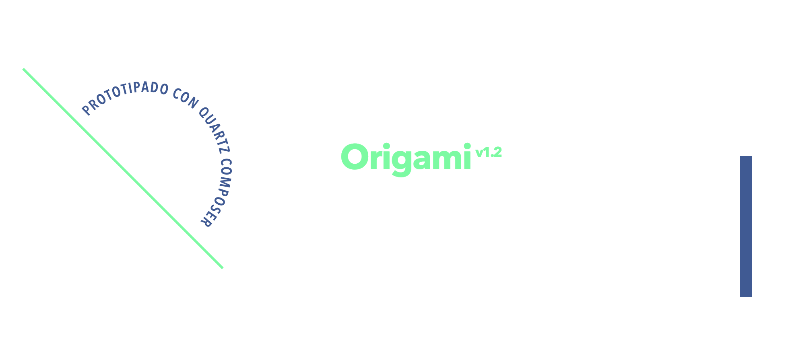
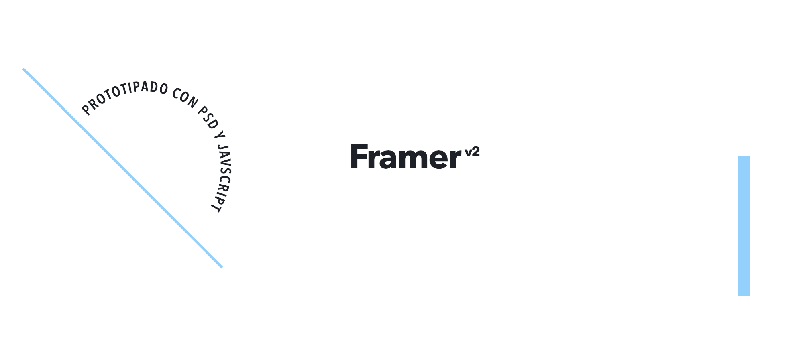

# Meetup Frontend Buenos Aires 2014

Slides, demos & samples of a brief presentation I gave in Buenos Aires (May 2014), kicking of the first Buenos Aires Frontend Meetup.





## Setup

This presentation was made with [Reveal.js (v2.6.2)](https://github.com/hakimel/reveal.js/tree/2.6.2). Feel free to fork and reuse.

1. Install [Node.js](http://nodejs.org/)

2. Install [Grunt](http://gruntjs.com/getting-started#installing-the-cli)

3. Clone this repository

    ```sh
    $ git clone https://github.com/davo/ba-frontend-2014.git
    ```

4. Navigate to the ba-frontend-2014 folder

    ```sh
    $ cd ba-frontend-2014
    ```

5. Install dependencies

    ```sh
    $ npm install
    ```

6. Serve the presentation and monitor source files for changes
    ```sh
    $ grunt serve
    ```
